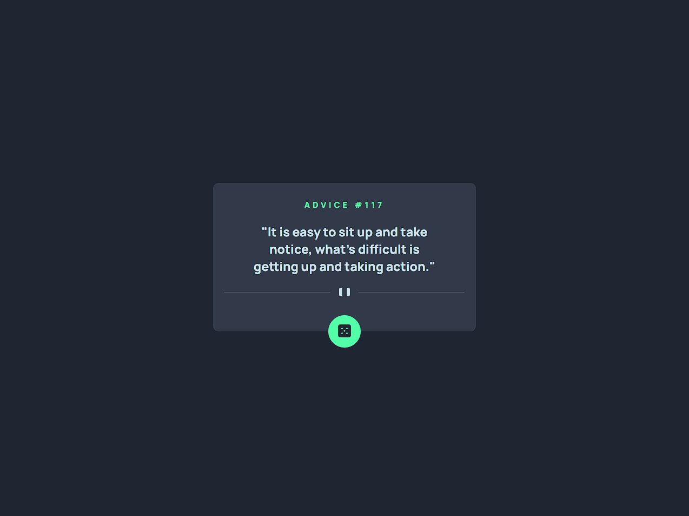
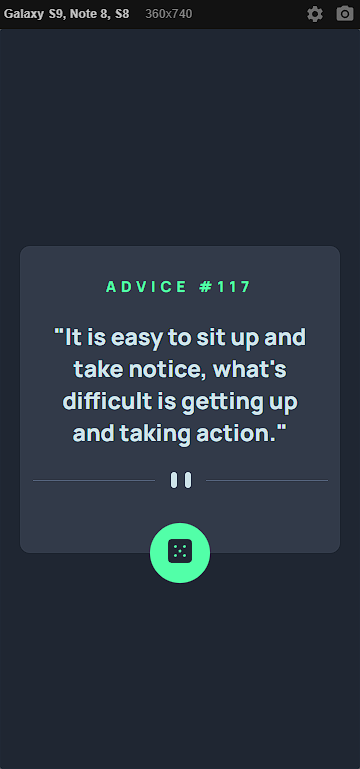
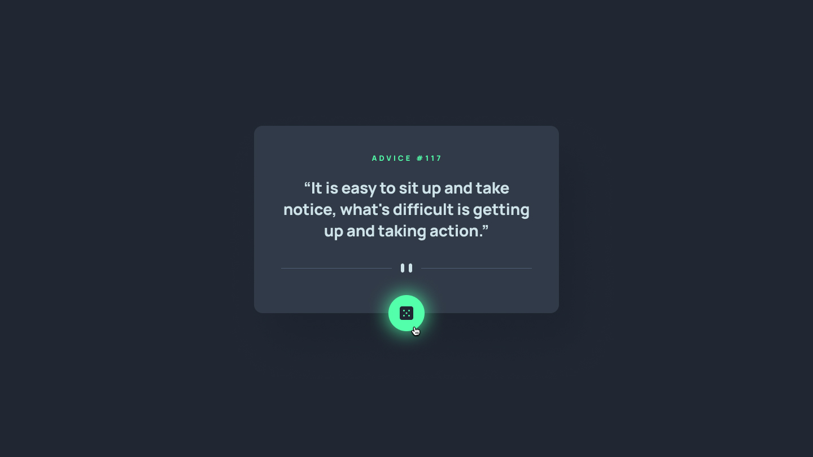

# Frontend Mentor - Advice generator app solution

This is a solution to the [Advice generator app challenge on Frontend Mentor](https://www.frontendmentor.io/challenges/advice-generator-app-QdUG-13db). Frontend Mentor challenges help you improve your coding skills by building realistic projects.

## Table of contents

- [Overview](#overview)
  - [The challenge](#the-challenge)
  - [Screenshot](#screenshot)
  - [Links](#links)
- [My process](#my-process)
  - [Built with](#built-with)
- [Author](#author)


## Overview

### The challenge

Users should be able to:

- View the optimal layout for the app depending on their device's screen size
- See hover states for all interactive elements on the page
- Generate a new piece of advice by clicking the dice icon

### Screenshot






### Links

- Solution URL: [Add solution URL here](https://your-solution-url.com)
- Live Site URL: [Add live site URL here](https://your-live-site-url.com)

## My process

### Built with

- Semantic HTML5 markup
- CSS custom properties
- Flexbox
- Mobile-first workflow


```html
<picture>
  <source srcset="./src/images/pattern-divider-mobile.svg" media="(max-width: 768px)">
  
</picture>

<button class="advice-update">
  
</button>
```
```css
@media(min-width: 768px) {
    .advice {
        padding-inline: 50px;
        width: 386px;
    }

    .advice p {
        font-size: 21px;
        padding: 26px;
    }
}

```
```css
Transform: translateY
.advice .advice-update {
    width: 60px;
    height: 60px;
    border-radius: 50%;
    border: none;
    background-color: var(--advice-dice-color);
    transform: translateY(50%);
}
```

## Author

- GitHub - [Julio Resende](https://github.com/julioresende77)
- Twitter - [@ResendeDev](https://twitter.com/ResendeDev)
- Frontend Mentor - [@yourusername](https://www.frontendmentor.io/profile/julioresende77)